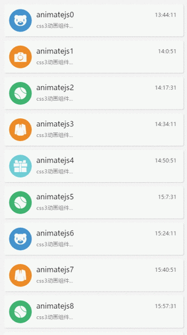

# animatejs 
css3移动端动画，动画方式很简单只需要添加指定方式的class即可实现很酷炫的动画，组件引入了<a href="http://www.dowebok.com/demo/2014/98/" target="_blank">animate.css</a>，目前只有里面的动画方式。组件可以用于酷炫的活动页面，页面交互动作等。

###npm安装
```javascript
npm install animateJs
```

demo地址:<br/> <br/>
<br/>
<a href="https://gtdalp.github.io/widget/animatejs/demos/animatejs.html">https://gtdalp.github.io/widget/animatejs/demos/animatejs.html</a><br/>
<br/>


###demo代码
```javascript
// 第一种执行方式
new Animatejs('#animatejs', [
    ['.animatejs1', 'bounceInRight', 1, 2],
    ['.animatejs2', 'bounceInLeft', 1],
    ['.animatejs3', 'bounceInLeft']
]);
// 第二种执行方式
new Animatejs([
    ['.animatejs1', 'bounceInRight', 1, 2],
    ['.animatejs2', 'bounceInLeft', 1],
    ['.animatejs3', 'bounceInLeft']
]);
```
```html
<div id="animatejs">
    <div class="animatejs1">animatejs1</div>
    <div class="animatejs2">animatejs2</div>
    <div class="animatejs3">animatejs3</div>
</div>
```

###api
<p>第一个参数为缩小查找范围的 dom ，可以省略不写，不写则直接获取为body</p>
<p>第二个参数为一个二维数组</p>
<p>数组第一个参数 '.animatejs1' 为需要执行动画的 dom元素 ，必须传值</p>
<p>数组第二个参数 'bounceInRight' 为需要执行动画的方式 class ，class可以到<a href="http://www.dowebok.com/demo/2014/98/" target="_blank">animate.css</a>里面找，必须传值</p>
<p>数组第三个参数 1s 为多少秒之后执行，可以为空，为空或者0，则直接执行</p>
<p>数组第四个参数 2s 为动画执行过程中使用多少秒，可以为空，默认为1秒</p>